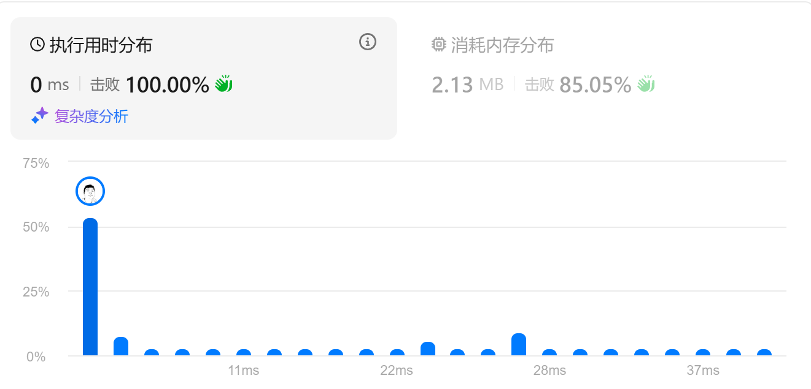

### 题目：
给定一个整数数组 nums 和一个整数目标值 target，请你在该数组中找出 和为目标值 target  的那 两个 整数，并返回它们的数组下标。你可以假设每种输入只会对应一个答案，并且你不能使用两次相同的元素。
你可以按任意顺序返回答案。
#### 示例 1：
输入：nums = [2,7,11,15], target = 9
输出：[0,1]
解释：因为 nums[0] + nums[1] == 9 ，返回 [0, 1] 。
#### 示例 2：
输入：nums = [3,2,4], target = 6
输出：[1,2]
#### 示例 3：
输入：nums = [3,3], target = 6
输出：[0,1]

#### 提示：
2 <= nums.length <= 104
-109 <= nums[i] <= 109
-109 <= target <= 109
只会存在一个有效答案

#### 解题思路：
1.双循环，时间复杂度O(n^2)
2.单循环+hashmap，时间复杂度O(nlogn)

满足条件即可退出循环

#### rust code:
```rust
fn two_sum(nums: Vec<i32>, target: i32) -> Vec<i32> {
  let mut map: HashMap<i32, i32> = HashMap::with_capacity(nums.len());
  for i in 0..nums.len() {
    let other = target - nums[i];
    if map.contains_key(&other) {
      return vec![*map.get(&other).unwrap(),i as i32];
    }
    if !map.contains_key(&nums[i]) {
      map.insert(nums[i], i as i32);
    }
  }
  vec![]
}
```




#### python3 code:
```python3
from typing import List
class Solution:
    def twoSum(self, nums: List[int], target: int) -> List[int]:
        mapping = {}
        for i in range(0, len(nums)):
            other = target - nums[i]
            if mapping.get(other) is not None:
                return [mapping.get(other), i]
            else:
                mapping[nums[i]] = i
        return []
```

