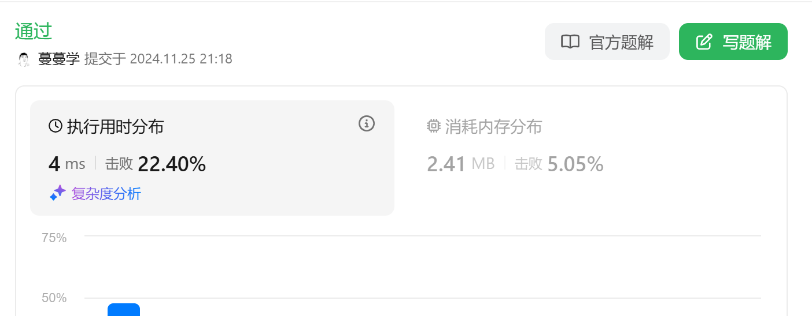

## 题目
给定一个字符串 s ，请你找出其中不含有重复字符的最长子串的长度

### 示例 1:
输入: s = "abcabcbb"
输出: 3 
解释: 因为无重复字符的最长子串是 "abc"，所以其长度为 3。

### 示例 2:
输入: s = "bbbbb"
输出: 1
解释: 因为无重复字符的最长子串是 "b"，所以其长度为 1。

### 示例 3:
输入: s = "pwwkew"
输出: 3
解释: 因为无重复字符的最长子串是 "wke"，所以其长度为 3。请注意，你的答案必须是 子串 的长度，"pwke" 是一个子序列，不是子串。
 

### 提示：

0 <= s.length <= 5 * 104
s 由英文字母、数字、符号和空格组成


### 解题思路
采用滑动窗口，定义窗口左右边界分别为l,r，用一个map维护窗口中已有的字符，逐个比较字符，移动窗口，找出最大的值。时间复杂度为O(n*m),m为不重复子串平均长度。
可以记录下最大取值时的左右边界，便于返回最长子串(题意没有这样要求，可以自行扩展)


### rust实现
```rust
pub fn length_of_longest_substring(s: String) -> i32 {
    if s.is_empty() {
        return 0;
    }
    let mut map: HashMap<char, usize> = HashMap::with_capacity(64);
    let (mut l, mut r) = (0, 0);
    let mut max_length = 0;
    let mut max_l_r = (0, 0);
    let chars = s.chars().collect::<Vec<char>>();
    let len = s.len();
    while r < len {
        if map.contains_key(&chars[r]) {
            let t_len = r - l;
            if t_len > max_length {
                max_length = t_len;
                max_l_r = (l, r);
            }

            let tr = *map.get(&chars[r]).unwrap();
            for i in l..=tr {
                map.remove(&chars[i]);
            }
            map.insert(chars[r], r);
            l = tr + 1;
        } else {
            map.insert(chars[r], r);
            println!("{}", chars[r]);
        }
        r += 1;
        //println!("{:?} {l} {r}",map);
    }

    if r != l {
        let t_len = r - l;
        if t_len > max_length {
            max_length = t_len;
            max_l_r = (l, r);
        }
    }
    //println!("{l} {r} {:?}", &s[max_l_r.0..max_l_r.1]);
    max_length as i32
}
```



### rust代码优化

通过hashmap直接更新left边界，一次遍历，找到最长无重子串。时间复杂度O(n)。

```rust
pub fn length_of_longest_substring(s: String) -> i32 {
    let mut map: HashMap<char, usize> = HashMap::with_capacity(128);
    let chars =s.chars().collect::<Vec<char>>();
    let mut left:i32 = -1;
    let len = s.len();
    let mut max_length:i32 = 0;
    for i  in 0..len{
        if map.contains_key(&chars[i]){
            left = left.max(*map.get(&chars[i]).unwrap() as i32);
        }
         map.insert(chars[i], i);
         max_length = max_length.max(i as i32-left);
    }
    max_length as i32
}
```


### python3 实现

```python

```
